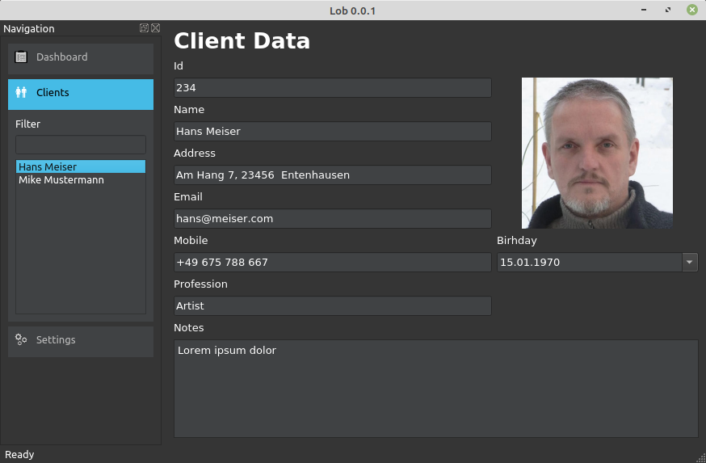
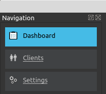

# Part IV LOB
##Develop of a line of business application



A LOB is an application where you have got a graphical user interface and where the data is stored in a database.  
In this case we have got a database with clients and we are able to add a new client, filter the list of clients and edit the data for a client.  
We can also store a picture for each client.  

In order to run the sample app you have to install the module tinydb.  

```console
user@machine:/path$ pip3 install tinydb
```

Tinydb is a very small but usefull database implementation written in Python. You don't need a server to store the data on. And you do not need the SQL language at all. Tinydb just simply stores pythonic data in a single file.  

Because of the fact, that this app is a little bit larger then all the others that I have posted here, I do not print all the source code here. You can get the source here on [github](https://github.com/Artanidos/PythonDesktopBook).

## Main
As before this time I put the main routine into the *main.py* in the Lob folder.  
There I am initializing the application object and I am setting the style to Fusion and I am initializing the color palette.  

```python
app = QApplication(sys.argv)
app.setStyle(QStyleFactory.create("Fusion"))
app.setStyleSheet("QPushButton:hover { color: #45bbe6 }")

p = app.palette()
p.setColor(QPalette.Window, QColor(53, 53, 53))
p.setColor(QPalette.WindowText, Qt.white)
p.setColor(QPalette.Base, QColor(64, 66, 68))
p.setColor(QPalette.AlternateBase, QColor(53, 53, 53))
p.setColor(QPalette.ToolTipBase, Qt.white)
p.setColor(QPalette.ToolTipText, Qt.black)
p.setColor(QPalette.Text, Qt.white)
p.setColor(QPalette.Button, QColor(53, 53, 53))
p.setColor(QPalette.ButtonText, Qt.white)
p.setColor(QPalette.BrightText, Qt.red)
p.setColor(QPalette.Highlight, QColor("#45bbe6"))
p.setColor(QPalette.HighlightedText, Qt.black)
p.setColor(QPalette.Disabled, QPalette.Text, Qt.darkGray)
p.setColor(QPalette.Disabled, QPalette.ButtonText, Qt.darkGray)
p.setColor(QPalette.Link, QColor("#bbb"))
app.setPalette(p)
```  
The color can be set in two different ways. You can use the RGB values ```QColor(53, 53, 53)``` or you might use a string ```QColor("#45bbe6")``` as we do in HTML.  

This time the code is a little bit more structured. The main.py is still in the root folder, so a use might see it immediately so the user knows what to start. And all other Python files are stored in the widgets folder.  

## MainWindow
The visual part of the application starts in the class MainWindow which I have stored in the file mainwindow.py.  

In the init method we are doing a couple of things a bit different than in the last chapters.  

```python
def __init__(self, app):
    QMainWindow.__init__(self)
    self.app = app
    self.clients = None
        
    self.initGui()
    self.readSettings()
    self.dashboard.setExpanded(True)
    self.showDashboard()
    self.loadDatabase()
    self.loadClients()
    self.statusBar().showMessage("Ready")
```

First of all we have got a parameter where we get the application object from the main routine. We are storing it for later. In that special case to set the font of the app after the user has changed the application settings.  

To arrange the code a little bit, I have created some methods to be called in a specific order. The first method is called ```initGUI()``` where we are creating the visual components for this window.  

Then we have got the method ```readSettings()``` where we are reading some parameters which we saved while finishing the app. For example we have saved the window position and the size, and then in this method we just restore this parameters.  

The rest of the methods are self explanatory in my opinion.  
But we are going through this in detail later.  

##InitGui
In the initGui method we set up the user interface.  

The first thing we want is a navigation.  
I have seen this in the admin client for WordPress and I liked it.  
When you click on an expander it while open and in parallel it will close other expanders with a nice animation.  
More details to this control later in the chapter Expander. 
 


```python
def initGui(self):
        self.dashboard = Expander("Dashboard", ":/images/dashboard_normal.png", ":/images/dashboard_hover.png", ":/images/dashboard_selected.png")
        self.content = Expander("Clients", ":/images/clients_normal.png", ":/images/clients_hover.png", ":/images/clients_selected.png")
        self.settings = Expander("Settings", ":/images/settings_normal.png", ":/images/settings_hover.png", ":/images/settings_selected.png")

        self.setWindowTitle(QCoreApplication.applicationName() + " " + QCoreApplication.applicationVersion())
        vbox = QVBoxLayout()
        vbox.addWidget(self.dashboard)
        vbox.addWidget(self.content)
        vbox.addWidget(self.settings)
        vbox.addStretch()

        content_box = QVBoxLayout()
        filter_label = QLabel("Filter")
        self.filter = QLineEdit()
        self.filter.textChanged.connect(self.filterChanged)
        self.client_list = QListWidget()
        self.client_list.setSizePolicy(QSizePolicy.Ignored, QSizePolicy.Fixed)
        self.client_list.currentItemChanged.connect(self.clientChanged)
        
        button_layout = QHBoxLayout()
        plus_button = FlatButton(":/images/plus.svg")
        self.trash_button = FlatButton(":/images/trash.svg")
        self.trash_button.enabled = False
        button_layout.addWidget(plus_button)
        button_layout.addWidget(self.trash_button)
        content_box.addWidget(filter_label)
        content_box.addWidget(self.filter)
        content_box.addWidget(self.client_list)
        content_box.addLayout(button_layout)
        self.content.addLayout(content_box)

        scroll_content = QWidget()
        scroll_content.setLayout(vbox)
        scroll = QScrollArea()
        scroll.setHorizontalScrollBarPolicy(Qt.ScrollBarAsNeeded)
        scroll.setVerticalScrollBarPolicy(Qt.ScrollBarAsNeeded)
        scroll.setWidget(scroll_content)
        scroll.setWidgetResizable(True)
        scroll.setMaximumWidth(200)
        scroll.setMinimumWidth(200)

        self.navigationdock = QDockWidget("Navigation", self)
        self.navigationdock.setAllowedAreas(Qt.LeftDockWidgetArea | Qt.RightDockWidgetArea)
        self.navigationdock.setWidget(scroll)
        self.navigationdock.setObjectName("Navigation")

        self.addDockWidget(Qt.LeftDockWidgetArea, self.navigationdock)

        self.showDock = FlatButton(":/images/menu.svg")
        self.showDock.setToolTip("Show Navigation")
        self.statusBar().addPermanentWidget(self.showDock)

        plus_button.clicked.connect(self.addClient)
        self.trash_button.clicked.connect(self.deleteClient)

        self.dashboard.expanded.connect(self.dashboardExpanded)
        self.dashboard.clicked.connect(self.showDashboard)
        self.content.expanded.connect(self.contentExpanded)
        self.content.clicked.connect(self.showClient)
        
        self.settings.expanded.connect(self.settingsExpanded)
        self.settings.clicked.connect(self.showSettings)
        
        self.showDock.clicked.connect(self.showMenu)
        self.navigationdock.visibilityChanged.connect(self.dockVisibilityChanged)

        self.client = None
        self.client_editor = None
```

Whats new here is the ```QDockWidget```.  
With this widget we, or better our users, are able to reorder the navigation panel.  
The user can drag the navigation window to the right side of the window or to the left side of the window.  
You are able to limit this regions with the following code.  
```
self.navigationdock.setAllowedAreas(Qt.LeftDockWidgetArea | Qt.RightDockWidgetArea)
```  
Also the position of the navigation dock will be stored in the settings.  
While testing this behaviour I found out, that when I closed the navigation window, I could not restore it. Therefore I had to delete the Lob.ini file which was stored under */home/[user]/.config/Company/Lob.ini*. Remember that files starting with a dot "." are invisible by default. So you have to make them visible pressing STRG-H in the file navigator.  

So keep in mind, not to close the navigation dock until you have created a menuentry or a button to make it visible again.  
To avoid the closing of the widget, or better say to be able to make it visible again, I used this method.  

```python
	self.showDock = FlatButton(":/images/edit_normal.png", ":/images/edit_hover.png")
	self.showDock.setToolTip("Show Navigation")
	self.statusBar().addPermanentWidget(self.showDock)
	self.showDock.clicked.connect(self.showMenu)
	self.navigationdock.visibilityChanged.connect(self.dockVisibilityChanged)

    def showMenu(self):
        self.navigationdock.setVisible(True)

    def dockVisibilityChanged(self, visible):
        self.showDock.setVisible(not visible)
```
I have created a button which will be displayed when the dock will get invisible.  
Before I forget to mention why I am using a ":" in front of the path of the image. 
This double point signals Qt that the image will be found as an embedded resource.  
Have a look at the following files:  
*resources.qrc*  
*resources.py*  
and  
*build.sh*  

In the file *resources.qrc* we are declaring the files to put as a resource.  
```
<RCC>
    <qresource>
        <file>images/edit_hover.png</file>
        <file>images/edit_normal.png</file>
```  
Then we run pyrcc5, a resource compiler delivered with PyQt5.  

```
pyrcc5 resources.qrc -o resources.py
```

And this commands creates the *resources.py* file.  
It contains all images in text form.  
```python
qt_resource_data = b"\
\x00\x00\x09\xb4\
```

We just have to import this file in every python file, where we are using such an image. Therefore I have also splitted the resources into two halfs, because in *main.py* we only use the *logo.svg* and we do not need to include all resources everywhere, because of performance.  
```python
import resources
```

In our sample we will switch between the client editor, the dashboard and the setting panel.  
To switch between these widgets, we are just setting the central widget of the window. But be careful, because this method will destroy the instance of the prior widget, so have to re-create the widget again and again.

```python
def showClient(self):
    self.client_editor = ClientEditor(self)
    self.setCentralWidget(self.client_editor)
```

The close event of the window is fired when we close the window.  

```python
def closeEvent(self, event):
        self.writeSettings()
        event.accept()
```

Here we wright the setting into an ini file.  

```python
    def writeSettings(self):
        settings = QSettings(QSettings.IniFormat, QSettings.UserScope, QCoreApplication.organizationName(), QCoreApplication.applicationName())
        settings.setValue("geometry", self.saveGeometry())
        settings.setValue("state", self.saveState())
        settings.setValue("database", self.database)
        settings.setValue("fontSize", str(self.fontSize))
```

And on program start we read this ini file and restore the settings.  

```python
    def readSettings(self):
        settings = QSettings(QSettings.IniFormat, QSettings.UserScope, QCoreApplication.organizationName(), QCoreApplication.applicationName())
        geometry = settings.value("geometry", QByteArray())
        if geometry.isEmpty():
            availableGeometry = QApplication.desktop().availableGeometry(self)
            self.resize(availableGeometry.width() / 3, availableGeometry.height() / 2)
            self.move(int(((availableGeometry.width() - self.width()) / 2)), int((availableGeometry.height() - self.height()) / 2))
        else:
            self.restoreGeometry(geometry)
            self.restoreState(settings.value("state"))
        self.database = settings.value("database")
        if not self.database:
            self.database = "."
        fs = settings.value("fontSize")
        if not fs:
            fs = 10
        self.fontSize = int(fs)
        font = QFont("Sans Serif", self.fontSize)
        self.app.setFont(font)
```

When we expand one of the expander in the navigation dock, the following events will be triggered as we have connected them before in the initGui method.  

```python
    def dashboardExpanded(self, value):
        if value:
            self.content.setExpanded(False)
            self.settings.setExpanded(False)

    def contentExpanded(self, value):
        if value:
            self.dashboard.setExpanded(False)
            self.settings.setExpanded(False)

    def settingsExpanded(self, value):
        if value:
            self.dashboard.setExpanded(False)
            self.content.setExpanded(False)
```  
To trigger the animations of the expanders, we just change their expande flag.  
The animations, closing one expander and opening the other, are running parallel, after changing the expanded flag.  

When the user enters a letter into the search field, then the filterChanged event will be triggered and there the client load will be performed.  
```
    def filterChanged(self):
        self.loadClients()

    def loadClients(self):
        if not self.clients:
            return

        self.client_list.clear()
        filter = self.filter.text()
        
        a = []
        for c in self.clients:
            if filter.lower() in c["name"].lower():
                a.append(c)

        s = sorted(a, key=namesort)
        for c in s:
            item = QListWidgetItem()
            item.setText(c["name"])
            item.setData(3, c)
            self.client_list.addItem(item)
        self.client_list.setCurrentRow(0)
```  
In the loadClient method we are going through each client and check if the name contains the filter value and if so we add this client to the list.  
This method is only useful if you have only a few hundreds of clients.  
Normally you will query an SQL-server for the result, so that not all client data has to be transported via the network from server to the client computer.  

To open the database we use the loadDatabase method.

```python
    def loadDatabase(self):
        try:
            self.db = TinyDB(os.path.join(self.database,"lob.json"))
            self.clients = self.db.table('Clients')
        except:
            print("Unable to open the database")
```
Here we load the json file from the specified path and initialize the clients array.  

To add a new client record we call the method add client.  
```python
    def addClient(self):
        now = datetime.now()
        newclient = {
            "number": "",
            "name": "", 
            "birthday_year": 1990,
            "birthday_month": 1,
            "birthday_day": 1,
            "profession": "",
            "address": "",
            "mobile": "",
            "email": "",
            "notes": ""
        }
        self.clients.insert(newclient)
        self.showClient()
        self.loadClients()
        q = Query()
        self.client = self.clients.get(q.name=="")
        self.client["name"] = ""
        self.client_editor.reload()
```
Here we are filling a record with data and insert the new record into the database. The data is written immediately into the file without a commit. After that we re-read the clients and look for the client with the blank name to focus on.  


To delete a client from the database we call the method deleteClient().  
```python
def deleteClient(self):
        self.clients.remove(doc_ids=[self.client.doc_id])
        self.loadClients()
```

To update a client record we call the updateClient method.  

```python
    def updateClient(self):
        for i in range(self.client_list.count()):
            item = self.client_list.item(i)
            c = item.data(3)
            if c.doc_id == self.client.doc_id:
                item.setData(3, self.client)
                item.setText(self.client["name"])
                break
```
Here we are going through all list items and after finding the one with the right doc_id we change the data using setData() and setText() to update the listview.  

When the uses selects another client in the list then the method clientChanged() will be called.  

```python
    def clientChanged(self, item):
        if item:
            self.client = item.data(3)
            if self.client_editor:
                self.client_editor.reload()
            self.trash_button.enabled = True
        else:
            self.client = None
            self.client_editor.reload()
            self.trash_button.enabled = False
```

## Client Editor
This is one of the three screen available to this application.  
In this screen there is one interesting new part, the imageselector, which is used to select an image for the client to store with its record.  
```python
        self.image = ImageSelector()
        self.image.clicked.connect(self.seek)

    def seek(self):
        fileName = ""
        dialog = QFileDialog()
        dialog.setFileMode(QFileDialog.AnyFile)
        dialog.setNameFilter("Images (*.png *.gif *.jpg);;All (*)")
        dialog.setWindowTitle("Load Image")
        dialog.setOption(QFileDialog.DontUseNativeDialog, True)
        dialog.setAcceptMode(QFileDialog.AcceptOpen)
        if dialog.exec():
            fileName = dialog.selectedFiles()[0]
        del dialog
        if not fileName:
            return

        # copy file to database dir
        name = os.path.join(str(self.win.client.doc_id) + ".png")
        path = os.path.join(self.win.database, "images", name)
        shutil.copy(fileName, path)
        self.image.setImage(QImage(path))
        self.clientChanged()
```
When the user clicks the imageselector, then the seek method is called.  
Here we open a file open dialog so the user may choose an image.  
We are setting a name filter with the following pattern:  
The name to be display in each line of the filter list, here Images and All. And in brackets we put the filters like (*.png) to list only files that ends with ".png".  
After the dialog is closed, we choose the first filename from a list.  
```python
fileName = dialog.selectedFiles()[0]
```
When the user selects a file then we copy it to the images folder and change the name to the doc_id (primary key) + ".png" so we can match this picture to a client record.  

Every time the user alters the data in the edit fields, the clientChanged method is called.  
```python
def clientChanged(self):
        if self.loading:
            return
        self.win.client["number"] = self.number.text()
        self.win.client["name"] = self.name.text()
        self.win.client["address"] = self.address.text()
        self.win.client["email"] = self.email.text()
        self.win.client["mobile"] = self.mobile.text()
        self.win.client["profession"] = self.profession.text()
        self.win.client["notes"] = self.notes.toPlainText()
        self.win.client["birthday_year"] = self.birthday.date().year()
        self.win.client["birthday_month"] = self.birthday.date().month()
        self.win.client["birthday_day"] = self.birthday.date().day()
        self.win.clients.update(self.win.client, doc_ids=[self.win.client.doc_id])
        self.win.updateClient()
```

Here we update the client record and send a message to the window so that the list, which displays the clients names, can be updated.  

## Dashboard
The dashboard is pretty much empty at this moment and can be used later to display some information when the user starts the application.  
Now it just displays some documentation for the user.  

The documentation is displayed as HTML in a text browser. This textbrowser support hyperlink. So when a user clicks on the hyperlink href='clients' the method navigate is triggert.  

```python
self.browser.anchorClicked.connect(self.navigate)
```

In the navigate method we are emitting two signals to call the mainwindow.  
```python
    def navigate(self, url):
        if url.toDisplayString() == "clients":
            self.clients.emit()
        elif url.toDisplayString() == "settings":
            self.settings.emit()
```

These signals are declared in the body of the class.  
```python
class Dashboard(QWidget):
    clients = pyqtSignal()
    settings = pyqtSignal()
```
And these signals will be connected in the mainwindow in the showDashboard method. 

```python
    def showDashboard(self):
        db = Dashboard()
        db.clients.connect(self.showClient)
        db.settings.connect(self.showSettings)
```

So everytime the user clicks on the hyperlink settings then the signal settings is emitted and therfore the connected method showSettings will be called.  
This terminology is called **Signals and Slots**.  
The class with the signal just fires the signal and all other objects can connect to this signal and gets the event when it's fired.  

## Settings Editor
Nothing special here. The only special here is the fact that we change the applications font immediately when the user enters the fontsize into the fontSize Spinbox.  
```python
        self.fontSize.valueChanged.connect(self.settingsChanged)

    def settingsChanged(self):
        self.win.fontSize = self.fontSize.value()
        font = QFont("Sans Serif", self.win.fontSize)
        self.win.app.setFont(font)
```

## Controls
Now we come to some user designed controls (widgets).  

### FlatButton
The FlatButton is just a QLable which we use as a button to display an image. In this case we give the filename of a svg (scalable vector graphics) to the class as an argument. This image has got a region with the special color "#ff00ff" which will be replaced with the highlight color of our app and the color "#0000ff" which will be replaced with the bg color of the button.  
With this method we are able to change the highlight color of the app and all buttons will change automatically.  

```python
    def createIcon(self, source, hilite_color):
        fp.write(data.replace("#ff00ff", hilite_color).replace("#0000ff", bg))
``` 

In the method setColors we are generating an image for each state of the button. One for normal, one for hovered and one for the disabled state.  
So when we hover over the button with the mouse we can see the changed color.
```python
   def setColors(self):
        self.label_normal_color = self.palette().buttonText().color().name()
        self.label_hovered_color = self.palette().highlight().color().name()
        self.label_disabled_color = self.palette().color(QPalette.Disabled, QPalette.ButtonText).name()

        self.normal_icon = QPixmap(self.createIcon(self.svg, self.label_normal_color))
        self.hover_icon = QPixmap(self.createIcon(self.svg, self.label_hovered_color))
        self.disabled_icon = QPixmap(self.createIcon(self.svg, self.label_disabled_color))

        if self.enabled:
            self.setPixmap(self.normal_icon)
        else:
            self.setPixmap(self.disabled_icon)
```

That means, that we just change the pixmap whenever the enter or the leave event is triggered.  
```python
   def enterEvent(self, event):
        if self.enabled:
            self.setPixmap(self.hover_icon)
        QWidget.enterEvent(self, event)

    def leaveEvent(self, event):
        if self.enabled:
            self.setPixmap(self.normal_icon)
        else:
            self.setPixmap(self.disabled_icon)
        QWidget.leaveEvent(self, event)
```

One special behaviour from PyQt5 is the use of properties. They are declared as follows.  
```python
    @pyqtProperty(bool)
    def enabled(self):
        return self._enabled

    @enabled.setter
    def enabled(self, enabled):
        self._enabled = enabled
        if enabled:
            self.setPixmap(self.normal_icon)
        else:
            self.setPixmap(self.disabled_icon)
        self.update()
```

To fire the clicked event we need to declare a signal in the body of the class and we have to emit it when the user clicks the mouse or in this case when the user clicks and releases the mouse.  

```python
class FlatButton(QLabel):
    clicked = pyqtSignal()

   def mouseReleaseEvent(self, event):
        if self.enabled:
            self.setPixmap(self.hover_icon)
            event.accept()
            self.clicked.emit()
```

### Hyperlink
The hyperlink is also derived from QLable and uses the ability to display HTML inside a lable.
Here we override the method setText() and we put the text between HTML syntax, so that the hyperlink will be displayed inside the lable.  
```python
   def setText(self, text):
        self.text = text
        super().setText("<a style=\"color: " + self.color + "; text-decoration: none; cursor: pointer;\" href=\"#/\">" + self.text + "</a>")
```
Nothing special in this class.  

### Expander
The expander is a bit more tricky.  
Here we have to animated the behaviour when the user clicks the expander to expand and when the user expands another expander this expander shall collapse.  
To archive the animation we are using a parallelanmation to animate the property color and the property maximumHeight.
```python
        self.anim = QParallelAnimationGroup()
        self.height_anim = QPropertyAnimation(self.content, "maximumHeight".encode("utf-8"))
        self.color_anim = QPropertyAnimation(self, "color".encode("utf-8"))
        self.height_anim.setDuration(200)
        self.color_anim.setDuration(200)
        self.anim.addAnimation(self.height_anim)
        self.anim.addAnimation(self.color_anim)
```

To be able to animate the color we have to create a property with that name.  
```python
    @pyqtProperty('QColor')
    def color(self):
        return Qt.black

    @color.setter
    def color(self, color):
        pal = self.palette()
        pal.setColor(QPalette.Background, QColor(color))
        self.setPalette(pal)
```
To be able to display different states we are using PNG images this time. This is just another variation as we used SVG in the FlatButton. This depends on the tools you are using to create icons.  
I am using Inkscape to create icons, so it makes sense to use SVG files in  general. But if you are only using a pixel based editor the PNG style fits best to you. So you know both methods.  

```python
self.dashboard = Expander("Dashboard", ":/images/dashboard_normal.png", ":/images/dashboard_hover.png", ":/images/dashboard_selected.png")
        
```

## Summary
You have seen who to create user controls, how to use a database to store data into a file, you have seen how to navigate between screens and you have seen how to create an app without the need to program a popup menu.  
Nowadays we develop many apps for the tablet instead of the desktop and there we don't use the mouse, so we cannot use the old school popup menu anymore.